# Web前端写给Web设计师的注意事项

> Web 设计和 Web 前端都应该仔细阅读此文档，会减少因为设计不合理导致的返工。

Web 设计因为要在浏览器中实现，有时还需要『动』起来，在设计时有一定的限制。

**前端同行应该以此文档作为审核设计稿的依据，不应该拿到设计稿直接开发。**

有任何问题请 [参与讨论](https://github.com/nimojs/web-desgin-notes/issues/new) [讨论列表](https://github.com/nimojs/web-desgin-notes/issues)

> 点击右上角的 **[Watch](https://github.com/nimojs/web-desgin-notes/subscription)** 订阅本文档更新，点击 Star 收藏本书

---

**索引**

[资源](#hash_collect)

1. [页面尺寸](#hash_size)
	1. [最小宽度](#hash_size_min-width)
	2. [响应式设计](#hash_responsive)
	3. [移动设备 Retina](#hash_retina)
2. [字体](#hash_font)
	1. [大小](#hash_font-size)
	2. [特殊字体](#hash_font-special)
	3. [字体图标](#hash_font-icon)
3. [内容溢出](#hash_text-overflow)
	1. [...](#hash_text-overflow-ddd)
	2. [裁剪](#hash_text-overflow-clip)
	3. [提示](#hash_text-overflow-tip)
4. [PSD](#hash_psd)
	1. [图层命名](#hash_psd-layer-name)
	2. [Retina](#hash_psd-retina)
	3. [标注](#hash_psd-marker)
	4. [字体](#hash_psd-font)
5. 栅格化
6. [状态](#hash_status)
	1. [Loading](#hash_status-loading)
	2. [hover](#hash_status-hover)
	3. [error](#hash_status-error)
	4. [分页](#hash_status-paging)
	5. [用户超时登出](#hash_status-logout)
7. [UI组件化](#hash_ui)
	1. [图表](#hash_ui-charts)
8. [typo 内容排版样式](#hash_typo)
	1. [富文本编辑](#hash_typo-rich-text-editor)
	2. [markdown](#hash_typo-markdown))
9. [技术团队审核设计稿](#hash_everyone_checkout)

---

<a name="hash_size" href="#hash_top">Top</a>

**资源**
1. [标你妹~啊-一款自动标注软件](http://www.biaonimeia.com/)
2. [微型设计专用工具Dorado](http://cdc.tencent.com/?p=3268)

## 页面尺寸

网页尺寸需要考虑浏览者的屏幕分辨率

<a name="hash_size_min-width" href="#hash_top">Top</a>

### 最小宽度

Github 页面最小宽度是 980px，当窗口大小小于 980px 时候会出现滚动条。

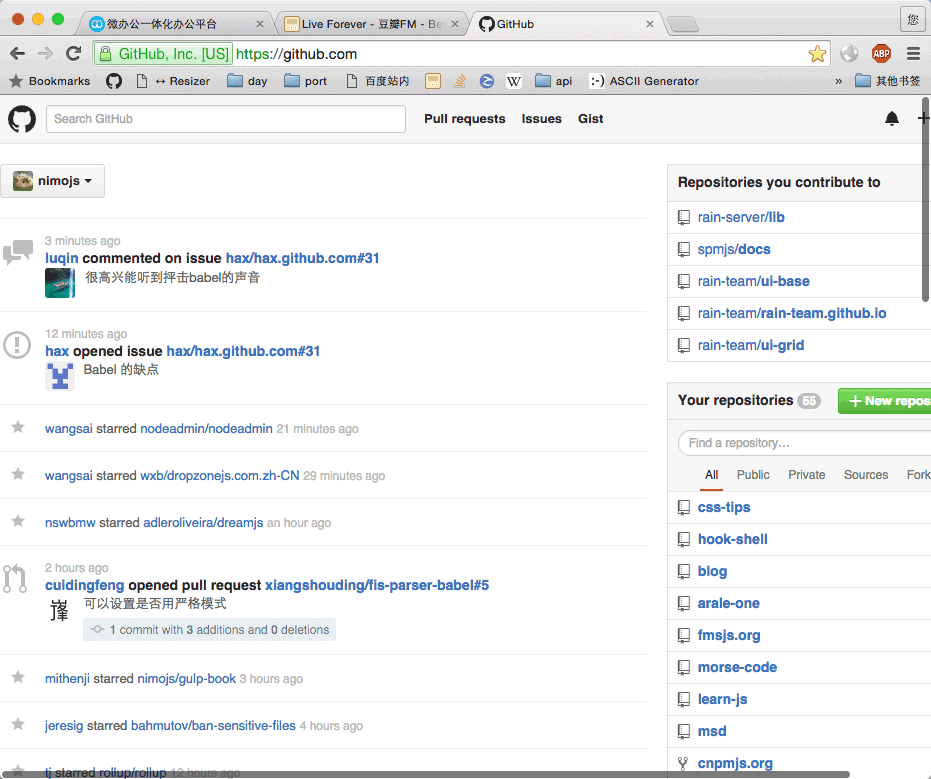

网页最小宽度是根据浏览者的电脑分辨率来定。

例如浏览者的分辨率是 1280x800
则最小宽度不可小于 *1240* `1280 - 40 = 1240`，因为网页可能会出现滚动条或一些工具栏。所以需要减去 40 像素。

> 下图中浏览器左侧有工具栏，右侧存在滚动条

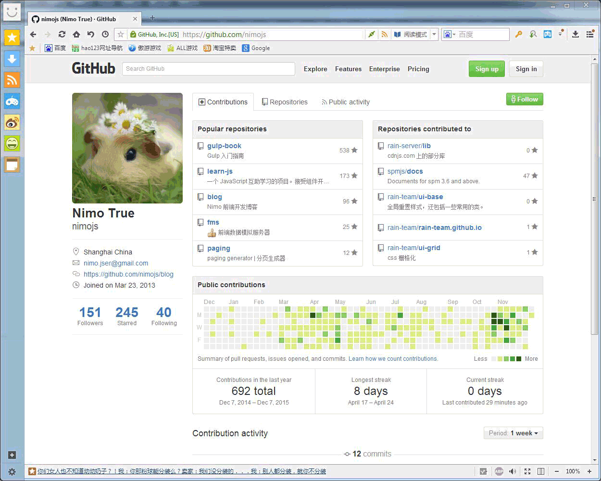

<a name="hash_responsive" href="#hash_top">Top</a>

### 响应式设计

响应式设计规范可参考 [https://github.com/ColdXu/grid-design](https://github.com/ColdXu/grid-design)

<a name="hash_retina" href="#hash_top">Top</a>

### 移动设备 Retina

手持设备的设计稿基准尺寸为 375px，普通屏显示正常，但在 Retina 屏幕下会出现图片模糊问题。 

对于 Retina 屏幕，为了达到高清效果，视觉稿的画布大小会是基准的2倍，最终设计稿尺寸是750px 

> iphone6 DPI 是 375 所以此处 设计稿基准尺寸是 375px,如果要兼容 iphone4/4s/5 则基准是 320（设计稿尺寸是 640px）

<a name="hash_font" href="#hash_top">Top</a>

## 字体

在网页中使用字体需要注意一些地方

<a name="hash_font-size" href="#hash_top">Top</a>

### 大小
内容性质字体大小不得小于 12px ，因为某些浏览器默认文字大小只能是 12px。网页中显示小于 12px 的文字会变形。

<a name="hash_font-special" href="#hash_top">Top</a>

### 特殊字体

> 这里的特殊字体指的是普通用户电脑中不存在的字体 

由于程序输出的文字不建议使用中文特殊字体，因为想要在用户电脑中使用中文特殊字体需要在浏览器中加载字体文件。而中文字体文件体积至少 1MB 以上

推荐一个中文特殊字体生成平台，可以在不使用图片的情况下使用固定的少量文字。[WebFont](http://iconfont.cn/webfont/#!/webfont/index) |  [浏览器使用示例](http://nimojs.github.io/web-design-notes/webfont.html)

若使用英文特殊字体，请将字体文件同 PSD 一并交付给前端。

<a name="hash_font-icon" href="#hash_top">Top</a>

### 字体图标
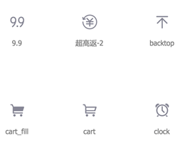
图标是网页中非常常见的元素，以前Web前端在实现时是通过图片实现。有如下缺点：

1. Retina 屏下因为图片分辨率太低会导致图标模糊
2. 图标多一种颜色就需要多切一张图（图片太多会增加页面访问时间）
3. 图标多一种尺寸需要多切一张图

**以上三个问题，用 iconfont 可以完美解决**

请点击 [示例](http://nimojs.github.io/web-design-notes/iconfont.html) 查看使用 iconfont 显示图标的效果。

[ICONFONT平台功能介绍](http://iconfont.cn/help/platform.html)

> 除了 iconfont.cn 还有很多类似的平台

<a name="hash_text-overflow" href="#hash_top">Top</a>

## 内容溢出

某些文字由程序输出的文字长度是无法确认的，需要设计时考虑文字超出容器大小时候的溢出处理方式。

<a name="hash_text-overflow-ddd" href="#hash_top">Top</a>

### ...

> 当文字超过一定字数后会出现 `...`
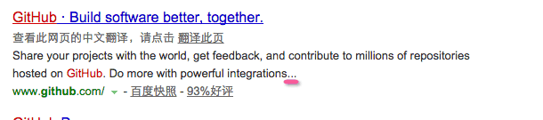

<a name="hash_text-overflow-clip" href="#hash_top">Top</a>

### 裁剪

> 一行文字占 20px ，最多只显示2行，超过2行的文字不显示
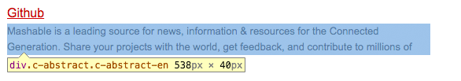

> 一行文字占 20px ，最多只显示1行，超过1行的文字不显示
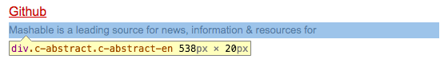

<a name="hash_text-overflow-tip" href="#hash_top">Top</a>

### 提示
> 当鼠标划入时出现完整内容信息
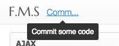

<a name="hash_psd" href="#hash_top">Top</a>

## PSD

<a name="hash_psd-layer-name" href="#hash_top">Top</a>
### 图层命名
> 这一项不是必须的，但是想**成为优秀设计师**必须做到这一点

<table>
  <thead>
  <tr>
     <th>
		结构清晰的命名
     </th>
     <th>
		糟糕的命名
     </th>
  </tr>
  </thead>
  <tbody>
  <tr>
     <td>
		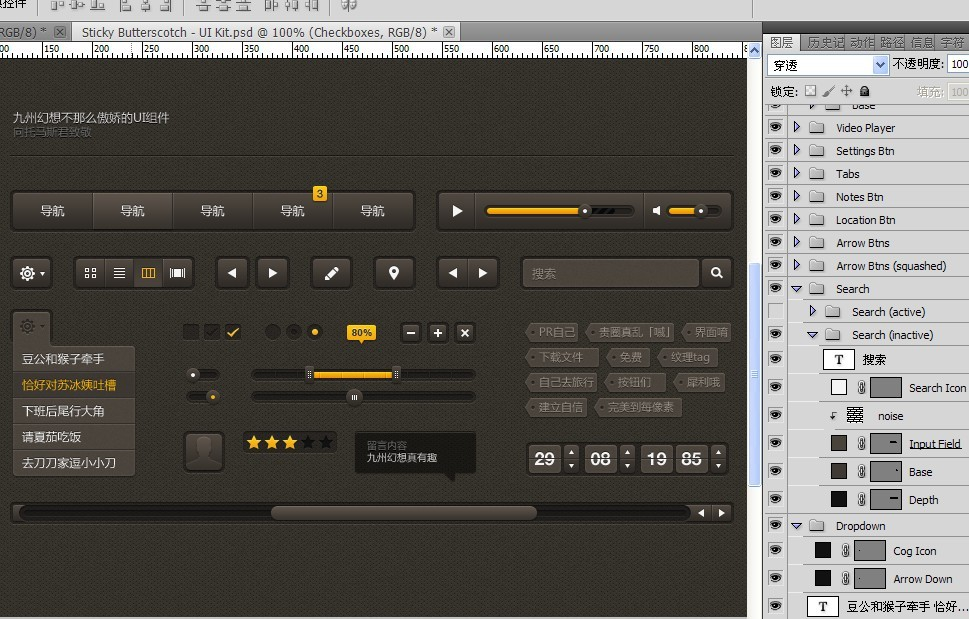
     </td>
     <td>
		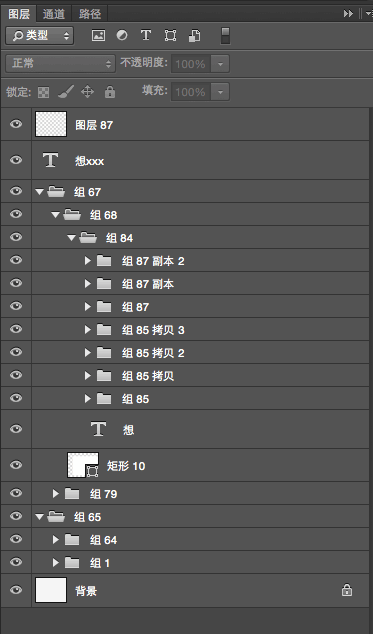
     </td>
  </tr>
  </tbody>
</table>

> 用中文命名也可以

合理的命名会在设计复杂页面时能快速找到相关图层，Web前端同事在 PSD 中找到相关资源也更方便。

<a name="hash_psd-retina" href="#hash_top">Top</a>
### Retina
欢迎提交 [issues](https://github.com/nimojs/web-design-notes/issues/new)或者 [New pull request](https://github.com/nimojs/web-design-notes/pulls)补充此章节

<a name="hash_psd-marker" href="#hash_top">Top</a>
### 标注

[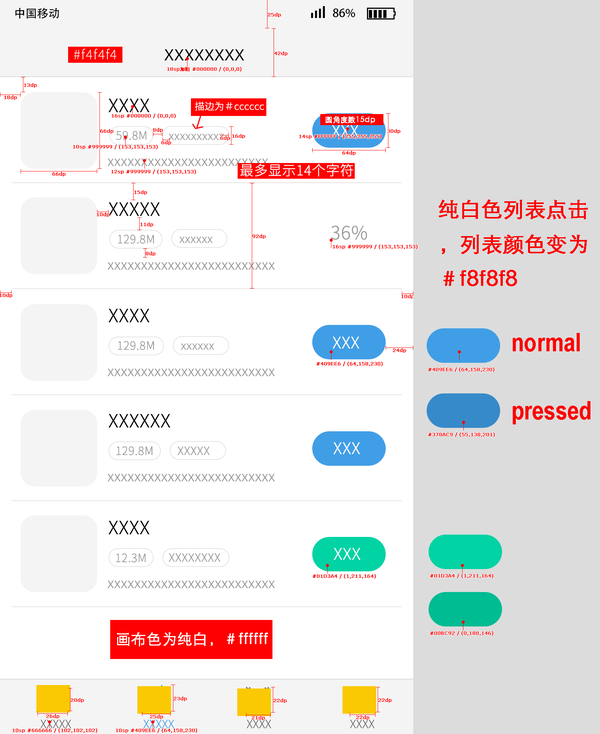](https://www.zhihu.com/question/27743708)

非常棒的设计稿会将具体尺寸都标注出来，包括元素的一些状态。[标注工具 Dorado](http://cdc.tencent.com/?p=3268)
并不是前端没有这个时间标注尺寸和颜色，而是当设计师对自己的设计稿进行标注后会有一个『检查』的过程。

例如：
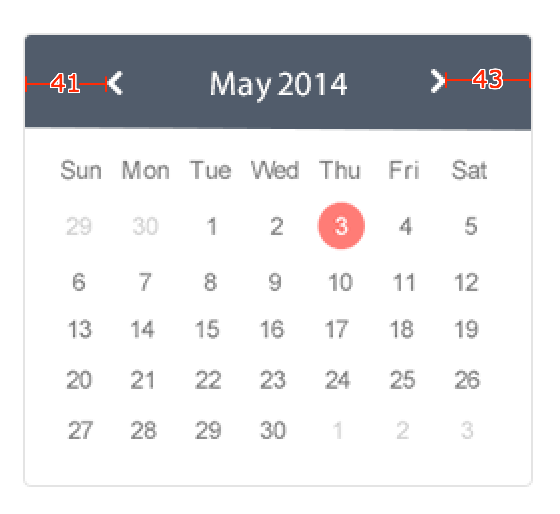
此处的标注是前端拿到设计稿后标注的。这里就会有个选择，箭头距边框距离是左41右43还是左右都42。

我估计设计的实际想法是左右都是42，因为要对称。但由于设计的时候出现几像素的偏差，导致前端测量时尺寸不对。

以上只是为了说明情况举的一个例子，实际开发过程中可能会遇到比这个例子更麻烦的问题。

**如果设计同事对设计稿进行了标注工作，可以『检查』自己的设计稿**

<a name="hash_psd-font" href="#hash_top">Top</a>
### 字体

> 不是必须的

若设计稿使用了特殊字体，建议提供设计稿时提供相应的字体文件。
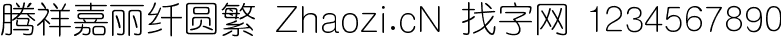

## 栅格化

## 状态

> 状态这一部分应该是给新手产品经理看的，但没有产品经理时设计应该注意状态的设计。

网页并不是一张禁止的图片，它的内容会变化，这种变化对应不同的状态。设计时需要考虑到这些状态，成熟的团队产品原型中会说明对应的状态，没有原型的情况下，设计需要考虑好状态。

### loading
有些内容并不是页面打开就加在完成的，而是有一个 loading 的过程。

<table>
  <thead>
  <tr>
     <th>
		鼠标划入开始加载
     </th>
     <th>
		加载完成
     </th>
  </tr>
  </thead>
  <tbody>
  <tr>
     <td>
		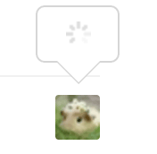
     </td>
     <td>
		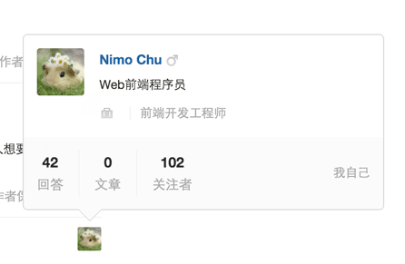
     </td>
  </tr>
  </tbody>
</table>

需要 loading 是因为如果页面打开就提供所有的数据，页面的打开速度会很慢。而且这些数据不是必要数据，当用户鼠标划入的时候才需要显示，这样就可以当鼠标划入时浏览器向服务器请求数据后显示，请求的过程需要出现 loading 提示用户。

### hover

Web 页面很多地方都是需要与用户交互的，最常见的就是按钮。设计时需要考虑到按钮的几个状态：

1. 默认（必须）
2. 鼠标划入（非必须）
3. 激活状态（非必须）
4. 禁用状态（非必须）

绝大部分按钮都需要设计鼠标划入状态。并在当前PSD或者设计说明PSD中展现出一个元素所有的状态

### error

错误状态是web页面中是很常见的，一般是由产品经理在提供原型时候考虑到哪些部分会出现错误状态。没有原型的情况下，设计同事应该与开发同事沟通，以确定哪些地方存在错误状态。并在设计稿中体现出错误状态。
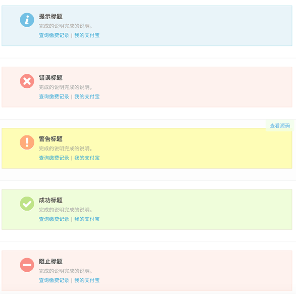

如果遗漏了错误状态的设计，并且前端审核设计稿时候也遗漏了错误状态的审核，那么会在后端同事拿到前端交付的代码时候让设计和前端返工添加错误状态，有可能就会因为返工而导致项目延期

**数据为空也是一种状态，也需要在设计时就考虑到**

### 分页

设计页面时需要考虑内容是否存在多页情况，若存在多页则需设计出分页样式。常见于列表。

### 用户超时登出

> 只有在页面停留时间长且单页操作交互频繁的业务场景下才需要考虑这一点，例如在线协同办公系统 [teambition](https://www.teambition.com/)

用户打开A页面和B页面，在A中用户点击`退出登录`，用户状态变为`未登录`。或后端 [session](http://baike.baidu.com/link?url=r6TK_IE6WOaxtxG1FvtUp1Uvm7GT26sBmXdCaRDCzBdXWDX29aF2CqYN2gXN7rNtTvT55ck4nUfda2m7stN98q) 过期导致当前设备变为`未登录`状态时，用户继续操作需要登录的页面功能时会应该出现提示：
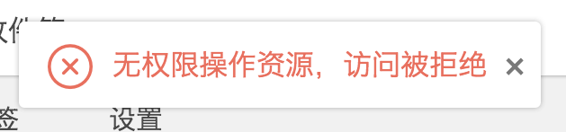
或者提示当前用户未登录，请重新登录。

## UI组件化

设计一套符合当前项目的UI风格并在界面中复用，能提高界面的统一性和提高开发效率。国内做的好并开源的一些产品

1. [支付宝 Alice](http://aliceui.org/)
2. [蚂蚁金服 Ant](http://ant.design/)
3. [百度产品线 GMU](http://gmu.baidu.com/)
4. [百姓网 CMUI](http://cmui.net/)
5. 此处省略

---

> Ant Design 是一个 UI 设计语言，是一套提炼和应用于企业级后台产品的交互语言和视觉体系。
> 
以 [Ant Design](http://ant.design/spec/font) 为例，这是一套蚂蚁金服团队基于自己产品所形成的一套 UI，已完成了设计阶段和前端实现阶段。蚂蚁金服基于这套 UI可以快速搭建页面并能保障界面统一。

### 图表

若项目中需要使用图表，建议与前端沟通后再设计，图表实现非常复杂，建议使用一些成熟的开源库。[echarts](http://echarts.baidu.com/)

## 内容排版

如果项目设计到管理后台添加内容发布，则需要考虑内容排版。**这一点经常被所有开发人员遗漏，导致最终管理后台发布的内容样式简陋，反复调整返工**。

内容排版的设计建议应该有**前端给出技术建议**，引导设计同事和决定管理后台使用何种编辑器

一般管理后台的富文本编辑器分为两种，分别是

1. 富文本编辑器
2. markdown

#### 富文本编辑器

[富文本编辑器示例](http://ueditor.baidu.com/website/onlinedemo.html)

> 前端可基于 [UEditor](http://ueditor.baidu.com/website/index.html) 实现富文本编辑器

不建议使用富文本编辑器，因为他的样式完全是有编辑器嵌入样式决定的。若采取此方案设计不需要考虑太多。但会有很多无法预知的问题。

#### markdown

> Markdown是一种可以使用普通文本编辑器编写的标记语言，通过简单的标记语法，它可以使普通文本内容具有一定的格式。

[markdown](http://baike.baidu.com/link?url=_XU2Jnvo9dqFrpHBF3TLauihJ4ot9pP4HWWXPMCLJq7k42zv7VzepFHVnYY_Zq4mi7a7gemRJNet3--ZjV8gC_) 

我并不建议直接让编辑人员使用 markdown 语法，而是按照 markdown 的限制，让编辑器只提供 HTML 所有的标签样式。

---

[typo.css](http://typo.sofi.sh/)

> 排版是一个麻烦的问题 # 附录一，需要精心设计，而这个设计却是常被视觉设计师所忽略的。前端工程师更常看到这样的问题，但不便变更。因为在多个 OS 中的不同浏览器渲染不同，改动需要多的时间做回归测试，所以改变变得更困难。而像我们一般使用的 Yahoo、Eric Meyer 和 Alice base.css 中采用的 Reset 都没有很好地考虑中文排版。typo.css 要做的就是解决中文排版的问题。

markdown 编辑器实现可关注 [simditor打包版](https://github.com/nimojs/simditor-pack) 项目

## 技术团队审核设计稿

外包项目和自由产品的设计稿审核方大都是客户和产品经理。很多团队技术人员不进行设计稿审核工作，这是非常错误的做法。

技术团队审核设计稿可在开发初期发现问题，立即纠正。否则拿到设计稿闷头开始做会导致开发到最后一步发现设计稿有问题需要找到设计同事修改、前端同事重新开发。

这是写给所有 Web 技术团队的每一个人的，也写给新手产品经理。

1. 设计自审
2. 产品经理审核
3. 前端审核
4. 后端审核

---

这里的每一节都是此文档维护者在团队中采坑一步步发现总结的经验，每次拿到设计稿按照此文档过一遍会减少很多无意义的返工。